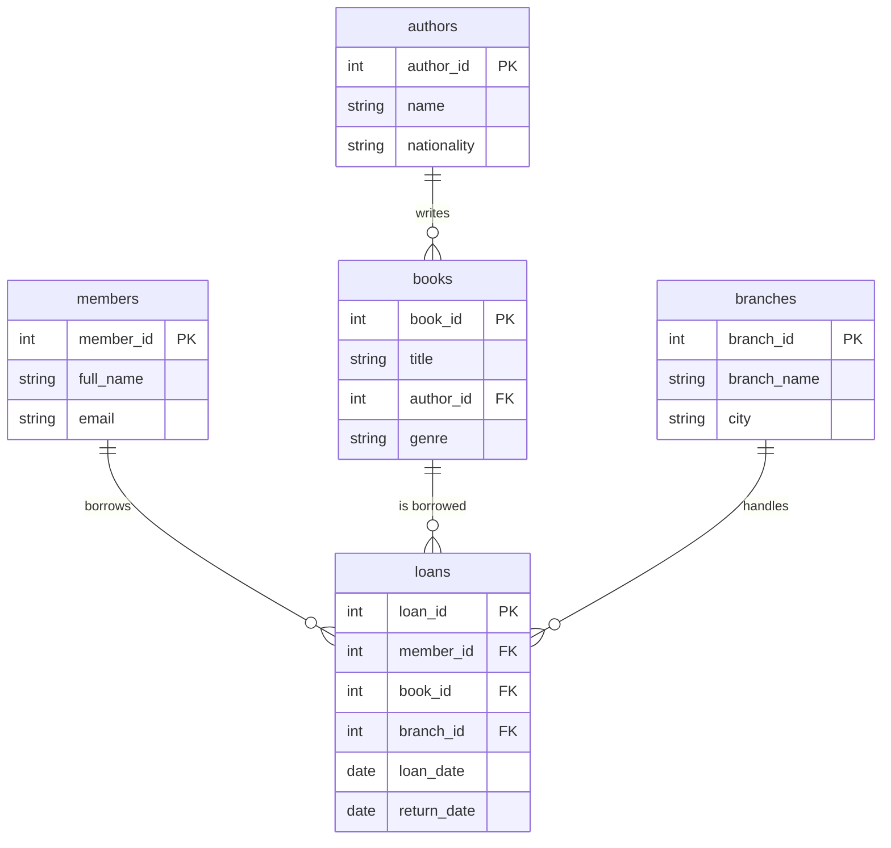

# 📚 Library JOIN Demo Explanation

This module demonstrates how to use SQL **JOIN** operations to combine data from multiple tables in a realistic Library Management System theme.

---

## 🏗️ Table Structure (Relational Model)

The demo uses 5 interconnected tables:



---

## 🔍 JOIN Examples Explained

### 1. INNER JOIN: Books with Authors
**Endpoint:** `GET /api/v1/library/books-with-authors`

> [!TIP]
> Use **INNER JOIN** when you only want rows where there is a match in BOTH tables.

If a book doesn't have an `author_id` (like our "Mystery Book"), it **will not appear** in this list.

```sql
SELECT b.title, a.name AS author_name
FROM books b
INNER JOIN authors a ON b.author_id = a.author_id;
```

### 2. LEFT JOIN: Members & Loan History
**Endpoint:** `GET /api/v1/library/members-loans`

> [!TIP]
> Use **LEFT JOIN** when you want ALL records from the "left" table (Members), even if they don't have matching records in the "right" table (Loans).

This allows us to see every member. If Alice has 2 loans, she appears twice. If Bob has 0 loans, he appears once with `NULL` loan details.

### 3. Multi-table JOIN: Active Loan Details
**Endpoint:** `GET /api/v1/library/active-loans`

This query combines **4 tables** to provide a human-readable report of books currently out on loan.

| Table | Information Provided |
|---|---|
| `loans` | The core record and loan date |
| `members` | The borrower's full name |
| `books` | The title of the book |
| `branches` | Where the book was borrowed from |

### 4. LEFT JOIN + IS NULL: Finding "Unread" Books
**Endpoint:** `GET /api/v1/library/unread-books`

> [!IMPORTANT]
> This is a powerful pattern for finding "missing" relationships.

By performing a `LEFT JOIN` on `loans` and filtering for `WHERE loans.loan_id IS NULL`, we identify books that exist in our database but have **never been borrowed**.

---

## 🧪 How to run this demo

1.  **Migrate & Seed**:
    ```bash
    npm run migrate
    npm run seed
    ```
2.  **Start Server**:
    ```bash
    npm run start:dev
    ```
3.  **Test with CURL**:
    ```bash
    curl http://localhost:3000/api/ v1/library/members-loans
    ```
